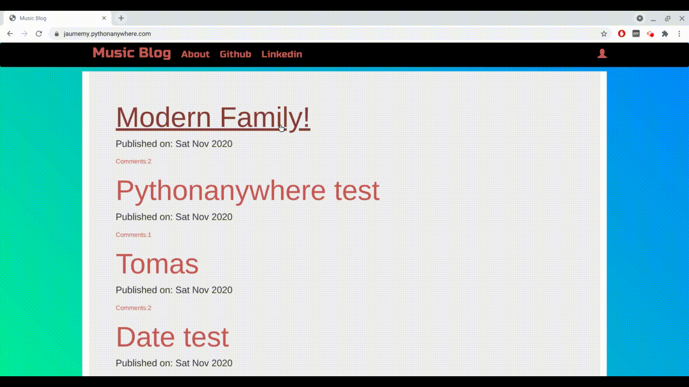

# Music Blog
> A colorful django-based blog              

## Live
You can take a look clicking [here](https://jaumemy.pythonanywhere.com/).

## Info

This is a basic blog where you can:        

* Create posts        
* Manage drafts        
* Approve or reject comments (as superuser)        
* Delete posts or comments        

If you are not logged in you can still:        

* View posts and comments        
* Post as visitor (needs to be accepted by superuser)            
    
It's called music blog just because I wanted to add some changing color in the background and letters, just for fun. 
              
           
## Technologies

For this project, I used Django, and some basic Html, Css and Javascript.       
It was my first project to deploy, so I learnt how to deploy it on [pythonanywhere.com](https://www.pythonanywhere.com/).
               
               
                 
## Motivation

It was the first full project on Django and I tried to add my personal touch as much as I could.        
_I was following Udemy's Course [Python and Django Full Stack Web Developer Bootcamp](https://www.udemy.com/share/101WisAEITeFhSTXoJ/)._
                       
                         
## Meta
                  
JMontane – [jmontane.dev](https://www.jmontane.dev)

Github profile [jaumemy](https://github.com/jaumemy/)

